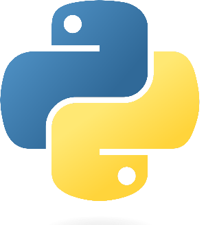

 (&copy;) *Software Validation*

---

# Documentation for the ***VectorCanoe***  Python module

## Table Of Contents

1. [Tutorials](tutorial.md)VectorCanoe

2. [Reference](reference.md)

## Overview

The ***myModuleName.py*** Python module is dedicated to the control of the ***CANoe application***.

CANoe is a development and testing software tool from *Vector informatick*.  
The CANoe automation is done via the win32com.client (COM automation) Python module.  
This module can only be used on the Windows OS.

The module contains the following classes:

- Canoe Main class to control the CANoe application.
- EnvironmentVariable Class to access an environment variable
- SystemVariable Class to access a simple system variable
- SystemArrayVariable Class to access an array system variable
