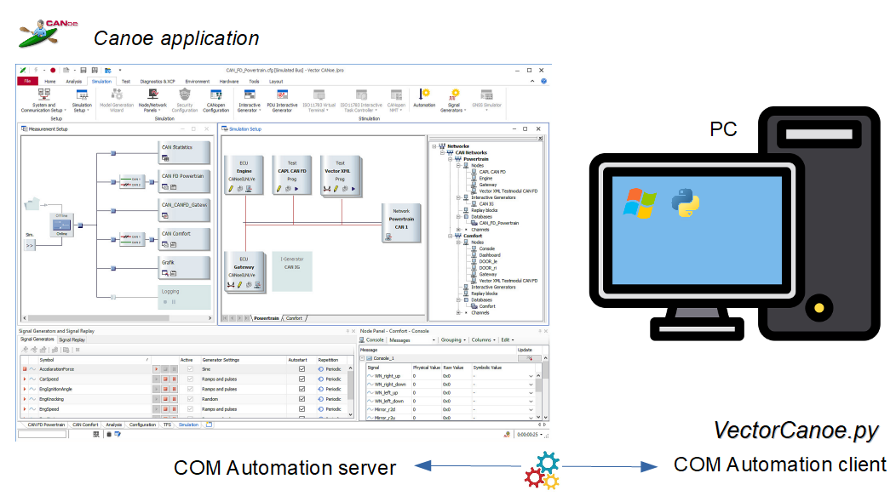
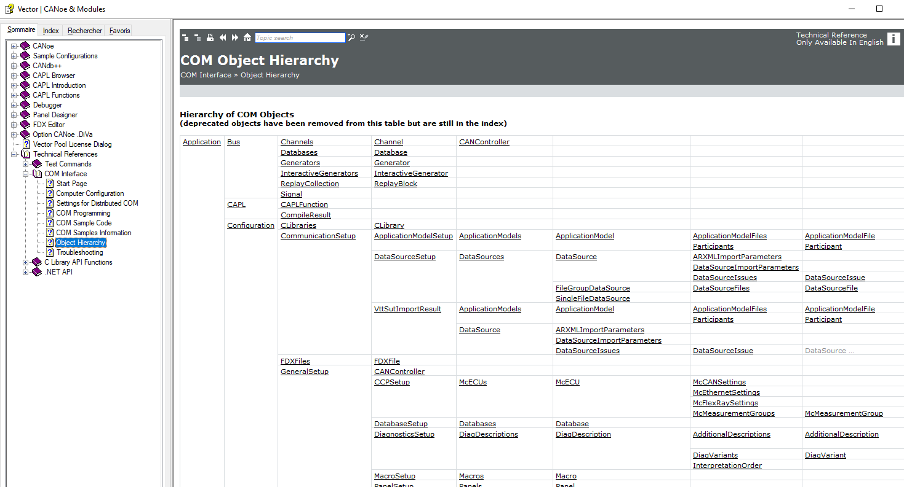
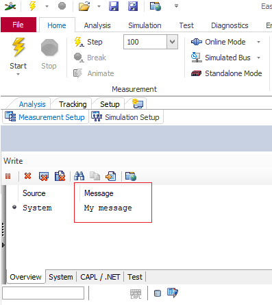
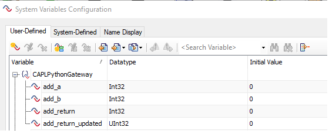
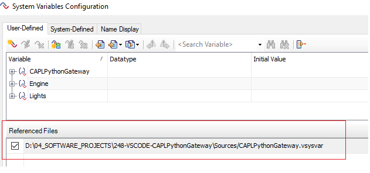
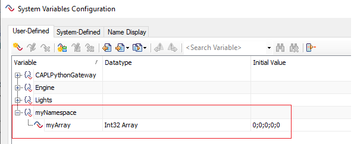
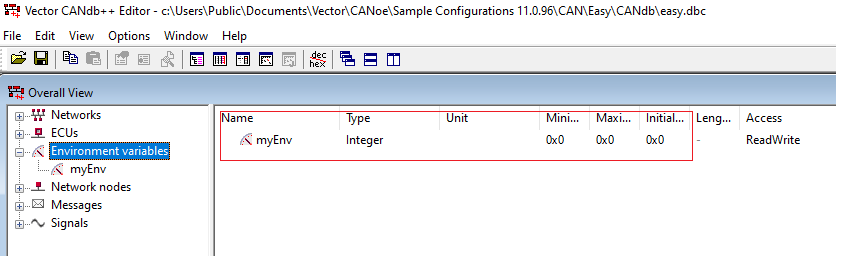

# Tutorial

## You'll learn how to get started using the ***VectorCanoe*** Python module



The ***VectorCanoe.py*** Python module is dedicated to the control of the ***CANoe application***.

CANoe is a development and testing software tool from *Vector informatick*. 
The CANoe automation is done via the win32com.client (COM automation) Python module.  
This module can only be used on the Windows OS.

The module contains the following classes:

- Canoe Main class to control the CANoe application.
- EnvironmentVariable Class to access an environment variable
- SystemVariable Class to access a simple system variable
- SystemArrayVariable Class to access an array system variable

## Requirements

- Vector CANoe application
- Python V3.9+ (*Software Validation* Python distribution)
- pywin32 Python package

## Installing and importing the module

The module can be installed by copy in your working directory.

```python
import sys
sys.path.append(".")
from VectorCanoe import *
```

## User functions development

It is possible to develop user functions based on the ***CANoe COM object hierarchy***.  
The **getApplication()** method of the **Canoe** class returns the entry points of the COM object hierarchy.

The ***CANoe COM object hierarchy*** documentation is accessible via the Vector CANoe tool help menu.



```python
myCanoe = Canoe()
app = myCanoe.getApplication()
```

COM object hierarchy entry points directory:

```python
dir(app)
['Bus',
 'CAPL',
 'CLSID',
 'ChannelMappingName',
 'Configuration',
 'Environment',
 'FullName',
 'GetBus',
 'GetNetworks',
 'GetSimulation',
 'Measurement',
 'Name',
 'Networks',
 'New',
 'Open',
 'OpenLink',
 'Parent',
 'Path', ]
```

## Services usage

&#9755; Refer to the ***reference chapter*** for the detailed services usage.

<hr>

Example: Canoe instance and methods

```python
myCanoe = Canoe()
# Check if measurement running
myCanoe.isMeasurementRunning()
False
# Start the measurement
myCanoe.startMeasurement()
# Check if measurement running
myCanoe.isMeasurementRunning()
True
myCanoe.stopMeasurement()
# Check if measurement running
myCanoe.isMeasurementRunning()
False
```

```python
# Write an user message in the CANoe console
myCanoe.writeMessage("My message")
```



```python
# Clear the CANoe console
myCanoe.ClearMessage()
```

```python
# List the system variables belonging to the "CAPLPythonGateway" namespace
myCanoe.listSystemVariables("CAPLPythonGateway")
['add_return_updated', 'add_return', 'add_b', 'add_a']
```



```python
# Add system variable file to the CANoe simulation
myCanoe.addSystemVariablesFile("../Sources/CAPLPythonGateway.vsysvar")
True
```



<hr>

Example: SystemVariable instance and methods

```python
myCanoe = Canoe()
# SystemVariable instance 
mySystemVariable = SystemVariable(myCanoe, "CAPLPythonGateway", 'add_b')
# Read operation
mySystemVariable.get()
0
# Write operation
mySystemVariable.set(10)
True
# Read operation
mySystemVariable.get()
10
```

<hr>

Example: SystemArrayVariable instance and methods

```python
myCanoe = Canoe()
# SystemArrayVariable instance 
mySystemArrayVariable = SystemArrayVariable(myCanoe, "myNamespace", "myArray")
# Read operation
mySystemArrayVariable.get()
(0, 0, 0, 0, 0)
# Write operation
mySystemArrayVariable.set([1,2,3,4,5])
True
# Read operation
mySystemArrayVariable.get()
(1, 2, 3, 4, 5)
```



<hr>

Example: EnvironmentVariable instance and methods

```python
myCanoe = Canoe()
# EnvironmentVariable instance 
myEnv = EnvironmentVariable(myCanoe, "myEnv")
# Read operation
myEnv.get()
0
# Write operation
myEnv.set(55)
True
# Read operation
myEnv.get()
55
```


